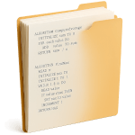

  

<h1 align="center">Soluciones AED – Guía de Trabajos Prácticos</h1>

Nombre: Tossutti M. C. Daniel

Comisión: C k1.3

Año de cursado: 2025

Soluciones que vaya haciendo durante la cursada.

 

## 📁 Estructura de archivos

Probablemente sea un despelote, pero trataré que se entienda de dónde saqué cada ejercicio.

 

## 🚀 ¿Puedo forkearlo?

Sí, siempre y cuando respetes la licencia de este repo.

 

Paz para todos los mortales. ♥️tmcd
